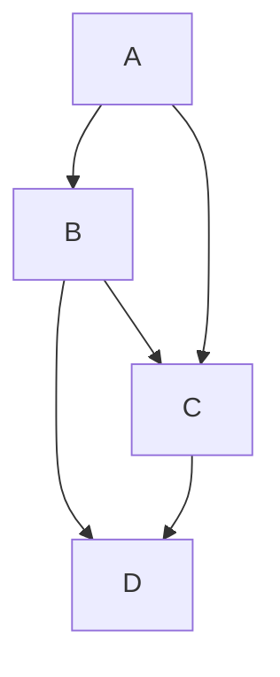

# Test

## Test

 

 

<!--MERMAID {width:100}-->

 

hello

 

This file was generated by Swimm. [Click here to view it in the app](https://app.swimm.io/repos/Z2l0aHViJTNBJTNBY29kZXBlbi1hZGJsb2NrZXIlM0ElM0FmZWxpeGhhZWJlcmxl/docs/uvsxf).